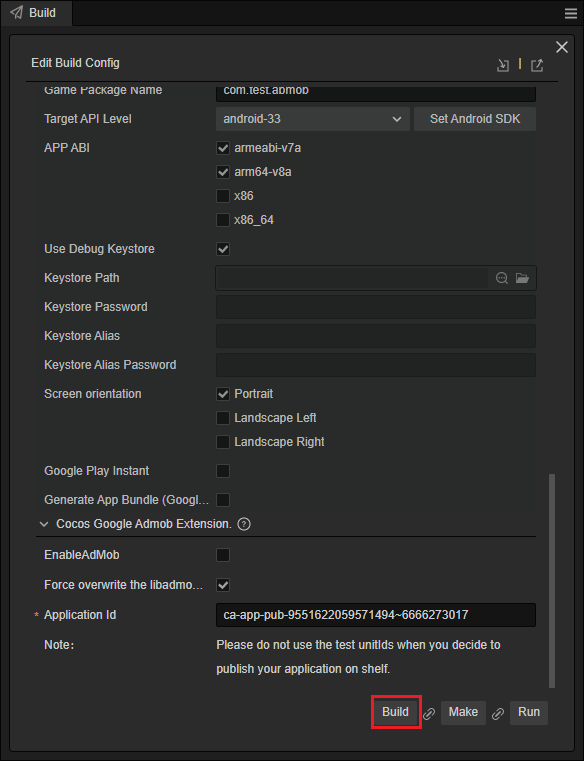

# Cocos Creator Google Mobile Advertisement Extension

This extension is designed for Cocos Creator to integrate the Google Mobile Ad SDK.

如果你需要中文文档，请移步 [CN](../zh/README.md)。

## Requirements

- Download [node.js](https://nodejs.org/en)
- Download [Cocos Creator](https://www.cocos.com/en)(Minimum version is 3.7.3)

## Work Flow

- Download this sample
- Open the terminal and enter the extension's directory

    ```bash
    cd ./extensions/amob
    ```

    Type `npm install` in the terminal

    ```bash
    npm install
    ```

- Open the project by Cocos Creator v3.7.3.
- Open the Extension Manager panel.

    

- Enable this extension in the installed page

    

- Create an Android Build Task

    

- Input your application Id, and check the **EnableAdmob** option
  
    

- Click on the Build button, and then open the Android project by AndroidStudio, then build the apk to test.

    

## Options

- Application Id: The application Id is generated in the back-end of Google admobile console.
- EnableAdmob: Whether to enable the extension  
  - When enabled, releated files include the gradle files and Android project configs will be modified.
  - When disabled, all configurations will be removed from the generated project.
- Force overwrite the libadmob: This option overwrites the libadmob project in the build directory with the extension's template, so don't check this option if you have modified libadmob in the build.
      - If you want to customize libadmob, it is recommended to modify the libadmob project in extension/admob/template, which will be **copied** to the corresponding project in the build.

## Integrate in JAVA

- Find the AppActivity.java in your generated Android Project
- Add the following code to the correct method:
  - onCreate: Add AdServiceHub.instance().init(this);
  - onDestroy: Add AdServiceHub.instance().destroy();

Code example:

```java
protected void onCreate(Bundle savedInstanceState) {
  super.onCreate(savedInstanceState);
    // DO OTHER INITIALIZATION BELOW
    SDKWrapper.shared().init(this);
    // start the admob extension
    AdServiceHub.instance().init(this);
}

@Override
protected void onDestroy() {
    super.onDestroy();
    // Workaround in https://stackoverflow.com/questions/16283079/re-launch-of-activity-on-home-button-but-only-the-first-time/16447508
    if (!isTaskRoot()) {
        return;
    }
    SDKWrapper.shared().onDestroy();        
    // destroy the admob extension
    AdServiceHub.instance().destroy();    
}
```
