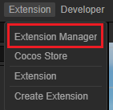
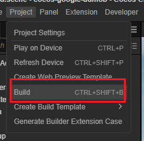
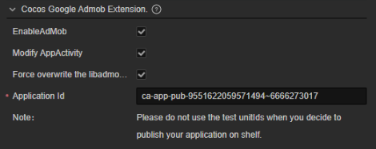
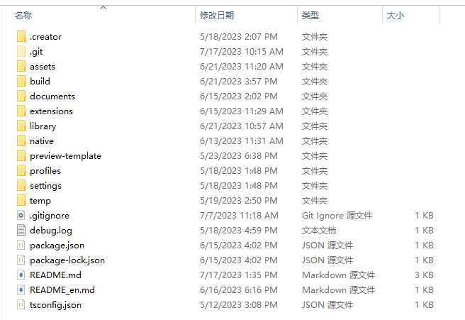

# Android 接入指南

## 安装

- 下载并安装 [node.js](https://nodejs.org/en)(推荐 v18.17.0)
- 下载并安装 [Cocos Creator](https://www.cocos.com/en) (最低支持为 v3.7.3 的 Cocos Creator)

## 使用流程

- 下载示例工程
- 在终端进入到扩展所在的目录

    ```bash
    cd ./extensions/amob
    ```

    Type `npm install` in the terminal

    ```bash
    npm install
    ```

- 打开扩展管理器

    

- 启用扩展

    

- 打开构建面板，并创建一个安卓的构建任务：

    

- 在构建面板填入配置好的应用 Id，勾选 **EnableAdmob**
  
    

- 点击构建，之后编译对应的安卓工程即可。

    

## 选项说明



- Application Id：在谷歌 Admob 控制台生成的 App Id
- EnableAdmob：是否启用 Admob
  - 启用后会修改对应的项目工程的文件以及相关
  - 不启动后点击生成会删除对应修改的项  
- Force overwrite the libadmob：该选项会使用插件的模板覆盖 build 目录内的 libadmob 项目，因此如果你修改了 build 内的 libadmob，那么不要勾选此选项
      - 如果要自定义 libadmob，建议修改 extension/admob/template 内的 libadmob 工程，发布时该项目会 **拷贝** 到 build 内对应的工程内。

## 构建后如何初始化

找到 Android 工程的 AppActivity.java 文件，添加如下的代码：

    - onCreate 中添加： AdServiceHub.instance().init(this);
    - onDestroy 中添加：AdServiceHub.instance().destroy();

代码示例如下：

```java
protected void onCreate(Bundle savedInstanceState) {
  super.onCreate(savedInstanceState);
    // DO OTHER INITIALIZATION BELOW
    SDKWrapper.shared().init(this);
    // 初始化 Admob 插件
    AdServiceHub.instance().init(this);
}

@Override
protected void onDestroy() {
    super.onDestroy();
    // Workaround in https://stackoverflow.com/questions/16283079/re-launch-of-activity-on-home-button-but-only-the-first-time/16447508
    if (!isTaskRoot()) {
        return;
    }
    SDKWrapper.shared().onDestroy();        
    // 销毁 Admob 插件
    AdServiceHub.instance().destroy();    
}
```

## 示例

在 [GITHUB](https://github.com/cocos/cocos-google-admob) 下载示例工程。

可以查看 assets/scripts/test 下查看各种广告的示例。

### 横幅示例

代码请参考 AdmobTestBanner.ts：

```ts
this.bannerClient = new BannerClient();
    this.bannerClient.load(TestUnitId.BannerAd, {
        onAdImpression: () => {
            log(module, "onAdImpression", "onAdClicked", this);
            this.buttonShowBanner.interactable = true;
            this.buttonHideBanner.interactable = true;
        },

        onAdClicked: () => {
            log(module, "onClickLoadBanner", "onAdClicked")
        },

        onAdLoaded: () => {
            log(module, "onClickLoadBanner", "onAdLoaded")
        },

        onAdFailedToLoad: (loadError: LoadAdError) => {
            log(module, "onClickLoadBanner", "onAdLoaded")
            throw new Error(`load Ad Error, the error is: ${loadError}.`);
        },

        onPaidEvent(paidNTF:BannerPaidEventNTF) {
            // paid event, you can do your own analysis here.
            log(module, "onPaidEvent", paidNTF);                
        },
        
    },  { size:BannerSize.BANNER, alignments:TopCenter});
```

在 BannerSize.ts 中提供了几种 Banner 的大小
在 BannerAlignment.ts 中预定义了两种 banner 的常用位置 TopCenter 和 BottomCenter。

更多请查看下文 [支持的广告类型](#支持的广告类型)

## 详情

### 安卓通信机制

在 Cocos Creator 发布原生的过程中，需要 TS/JS 和原生交互的，一般来说有几个方案：

- [基于反射机制实现 JavaScript 与 Android 系统原生通信](https://docs.cocos.com/creator/manual/zh/advanced-topics/java-reflection.html)
- [使用 JsbBridge 实现 JavaScript 与 Java 通信](https://docs.cocos.com/creator/manual/zh/advanced-topics/js-java-bridge.html)
- [Swig](https://docs.cocos.com/creator/manual/zh/advanced-topics/jsb-swig.html)

其中反射的调用机制，需要明确知道类名以及方法名，还需要设计好对应的参数，使用起来比较复杂。
Swig 更适合一些需要频繁调用的部分。

因此插件在设计时，采用了 [使用 JsbBridge 实现 JavaScript 与 Java 通信](https://docs.cocos.com/creator/manual/zh/advanced-topics/js-java-bridge.html) 方法。通过两个 `String` 类型的参数来作为传递的内容：

- arg0： 方法名称，用类名作为定义
  - 在 JAVA 端，使用 `class.getSimpleName()` 获取
  - 在 TS  端，使用 `js.getClassName` 来获取，注
  - 没有引入其他的用于解析的类型，如果开发者需要自定义，也可以使用如 protobuf 等序列化的库
- arg1： 具体的协议，将 java 的 class 以及 ts 的 class 序列化为 JSON 传递。  

> **注意**：因为要使用内置的 native.bridge，所以会覆盖掉 `native.bridge` 的 `onNative` 方法，如果你也要使用 `native.bridge` 去对接其他的 SDK，这里建议采取和本插件一致的方法。

- TS 端

    ```ts
    import { bridge } from "db://admob/core/core/Bridge";
    import { route } from "db://admob/core/core/Route";

    // 发送到原生
    bridge.sendToNative("your message here", message);

    // 从原生接收消息
    route.on("your message here", (message)=>{

    })

    ```

- 原生 JAVA 示例：

    ```java
    import com.cocos.admob.core.Bridge;

    // 接收 ts 的消息
    bridge.getRoute().on("your message from ts", arg->{

    });

    // 发送给 ts
    bridge.sendToScript("your message", message);
    ```

### 目录说明



- assets 测试用的场景和资源
- extension/admob 插件所在的目录
- native Cocos Creator 生成的原生代码路径
- 其他： 其他 Cocos Creator 自动生成的路径

### 运行要求

- 同时满足 Cocos Creator 以及 Google Admob 的最低版本要求的安卓设备

- 设备上有安装谷歌服务，并且可以正确的访问谷歌服务器。否则无法正确启动。

- 发布时的 Api Level  >= 31。

## 支持的广告类型

- [横幅](./Banner.md)
- [插页式](./Interstitial.md)
- [开屏](./AppOpenAd.md)
- [激励广告](./Rewarded.md)
- [插页式激励广告](./InterstistualRewadedAd.md)
- [原生](./NativeAd.md)
